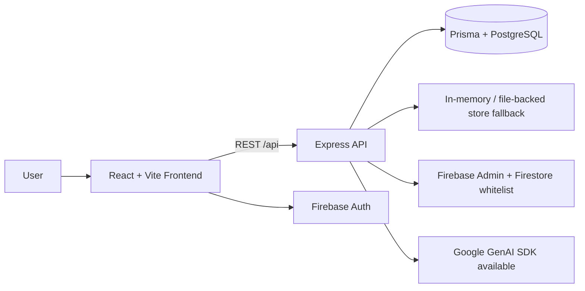

# 🚀 Velora Store

[](https://www.typescriptlang.org/)
[](https://react.dev/)
[](https://vite.dev/)
[](https://expressjs.com/)
[](https://www.prisma.io/)
[](https://www.postgresql.org/)
[](https://firebase.google.com/)
[]()

A polished full-stack e-commerce platform built with **React**, **Express**, **Prisma ORM**, **Supabase PostgreSQL**, and **Firebase Google Sign-In**. Velora Store combines a modern shopping experience with a feature-rich admin console for product, order, customer, coupon, review, banner, and settings management.

> Live demo: https://velora-store-ashy.vercel.app

---

## ✨ Overview

Velora Store is designed as a production-style e-commerce storefront and admin system for teams that want a modern retail experience with structured management workflows.

It provides:

- A customer-facing shopping interface with home, catalog, product, cart, checkout, orders, profile, and wishlist views
- An admin portal with role-gated access and operational tools for store management
- A TypeScript-first codebase with a server API, shared domain models, and Prisma schema for PostgreSQL
- Firebase-based Google authentication for admin users, plus standard customer auth flows

The project is well-suited for showcasing full-stack product engineering, ecommerce workflows, and admin dashboard design in a portfolio.

---

## 🎯 Key Features

| Feature | Description |
| --- | --- |
| 🛍️ Storefront UX | Customer-facing home page, catalog, product details, cart, checkout, orders, profile, and wishlist flows. |
| 🛡️ Admin Console | Role-gated admin dashboard with modules for products, categories, orders, customers, coupons, reviews, banners, and settings. |
| 🔐 Authentication | Customer auth endpoints plus Firebase Google Sign-In for admin access. |
| 📦 Product Management | Create, edit, delete, archive, filter, and browse products with category and stock metadata. |
| 🧾 Order Operations | Order creation, status updates, tracking info, cancellation, and order history views. |
| 🏷️ Promotions | Coupon creation/validation, featured banners, promotional sections, and flash-sale support. |
| 💬 Reviews & Moderation | Product reviews with admin moderation endpoints. |
| ❤️ Wishlist & Cart | Persistent cart and wishlist behavior for customers. |
| 🔔 Notifications | User and broadcast notifications with read/unread handling. |
| 🎨 Modern UI | Tailwind-based styling, motion animations, dark mode support, icons, and polished visual hierarchy. |
| 📊 Analytics-ready Admin | Dashboard stats and customer summaries exposed through admin endpoints. |
| 🧠 GenAI-ready Dependency | Google GenAI SDK is included in the stack, though no standalone AI workflow is exposed in the inspected source. |

---

## 🛠️ Tech Stack

### Frontend

- [React 19](https://react.dev/)
- [Vite 6](https://vite.dev/)
- [TypeScript](https://www.typescriptlang.org/)
- [Tailwind CSS 4](https://tailwindcss.com/)
- [Lucide React](https://lucide.dev/)
- [Motion](https://motion.dev/)
- [Recharts](https://recharts.org/)
- [Canvas Confetti](https://www.npmjs.com/package/canvas-confetti)

### Backend

- [Express](https://expressjs.com/)
- Node.js ESM runtime
- REST API under `/api`
- CORS + JSON body parsing
- Role-based admin middleware

### Database

- [Prisma ORM](https://www.prisma.io/)
- PostgreSQL datasource
- Supabase-compatible connection configuration via `DATABASE_URL` and `DIRECT_URL`

### Authentication / External Services

- [Firebase Authentication](https://firebase.google.com/products/auth) for Google Sign-In
- [Firebase Admin SDK](https://firebase.google.com/docs/admin) for token verification and admin whitelist checks
- Firestore collection `velorastoreadmins` for admin authorization
- [Google GenAI SDK](https://www.npmjs.com/package/@google/genai) present in dependencies
- Cloudinary is described in the repository metadata, but no confirmed implementation details were visible in the inspected source files

### DevOps / Tooling

- TypeScript compiler checks
- Prisma client generation on install/build
- `tsx` for local dev server execution
- `esbuild` for server bundling
- Vite static build pipeline

---

## 🏗️ Architecture

Velora Store follows a clear full-stack split:

- **Frontend**: React SPA with shared contexts for auth, store state, cart, wishlist, toast notifications, and theme handling
- **Backend**: Express API serving customer and admin endpoints
- **Database layer**: Prisma schema targeting PostgreSQL, with a local in-memory/file-backed store also present in the server code for demo and fallback behavior
- **Authentication**: Firebase client auth for Google Sign-In and Firebase Admin verification on the server



---

## 📁 Project Structure

```text
.
├── prisma/
│   └── schema.prisma          # PostgreSQL schema and domain models
├── server.ts                  # Root Express/Vite server entry used in dev
├── src/
│   ├── App.tsx                # App shell, providers, and route/view switching
│   ├── main.tsx               # React entry point
│   ├── components/            # UI components and feature views
│   ├── context/               # Auth, store, cart, wishlist, toast, theme state
│   ├── lib/                   # API client, Firebase client, utilities
│   ├── server/                # API routes, middleware, storage, Firebase admin
│   ├── types/                 # Shared domain types
│   └── index.css              # Global styles and Tailwind setup
├── package.json               # Scripts and dependencies
└── tsconfig.json              # TypeScript configuration
```

### Notable directories

- `src/components/` — storefront and admin UI modules
- `src/context/` — app-wide state management and auth orchestration
- `src/server/routes/` — REST endpoints for commerce and admin workflows
- `src/server/db/` — data store utilities and Prisma client wiring
- `prisma/` — canonical database schema and enums

---

## ⚙️ Getting Started

### Prerequisites

- Node.js 18+ recommended
- npm
- PostgreSQL database if you want to use Prisma persistence
- Firebase project for Google Sign-In/admin auth

### Installation

```bash
npm install
```

### Environment Variables

Create a `.env` file with values appropriate for your setup:

```env
# App
PORT=3001
NODE_ENV=development
VITE_API_URL=http://localhost:3001

# Prisma / PostgreSQL
DATABASE_URL=your_postgres_connection_string
DIRECT_URL=your_direct_postgres_connection_string

# Firebase Web Client
VITE_FIREBASE_API_KEY=your_firebase_api_key
VITE_FIREBASE_AUTH_DOMAIN=your_project.firebaseapp.com
VITE_FIREBASE_PROJECT_ID=your_firebase_project_id
VITE_FIREBASE_STORAGE_BUCKET=your_project.appspot.com
VITE_FIREBASE_MESSAGING_SENDER_ID=your_sender_id
VITE_FIREBASE_APP_ID=your_firebase_app_id

# Firebase Admin
FIREBASE_SERVICE_ACCOUNT=your_service_account_json_or_base64
```

### Run Locally

```bash
npm run dev
```

For production-style build and server start:

```bash
npm run build
npm run build:server
npm run start
```

### Useful Scripts

| Script | Purpose |
| --- | --- |
| `npm run dev` | Starts the development server with `tsx watch server.ts` |
| `npm run build` | Generates Prisma client and builds the Vite frontend |
| `npm run build:server` | Bundles the server into `dist/server.js` |
| `npm run start` | Runs the built server |
| `npm run lint` | Type-checks the project with `tsc --noEmit` |
| `npm run clean` | Removes the `dist` folder |

---

## 🧪 Testing

No dedicated test framework or test script was found in the inspected repository files.

The available quality-check command is:

```bash
npm run lint
```

---

## 🚀 Deployment

The repository is already aligned with a deployment-friendly setup:

- The repo homepage points to a **Vercel** deployment
- The Express app supports production static serving from `dist/`
- Prisma is configured for PostgreSQL-compatible environments
- Firebase Admin can be configured via environment variables for production

Typical deployment flow:

1. Set production environment variables
2. Run the build steps
3. Deploy the frontend and server bundle to your hosting target
4. Ensure PostgreSQL and Firebase credentials are configured correctly

> The exact deployment platform configuration is not fully defined in the inspected source, so use the environment and build settings above as the source of truth.

---

## 🔌 API Documentation

The backend exposes REST endpoints under `/api`.

### Authentication

| Method | Endpoint | Description |
| --- | --- | --- |
| `POST` | `/api/auth/login` | Demo-style customer/admin sign-in by email |
| `POST` | `/api/auth/register` | Customer registration |
| `POST` | `/api/auth/reset-password` | Password reset acknowledgement |
| `POST` | `/api/auth/admin-login` | Firebase Google Sign-In admin verification |
| `PUT` | `/api/auth/profile` | Update user profile |

### Core Commerce

| Method | Endpoint | Description |
| --- | --- | --- |
| `GET` | `/api/products` | List/filter products |
| `GET` | `/api/products/:idOrSlug` | Fetch a product and its reviews |
| `GET` | `/api/categories` | List categories |
| `GET` | `/api/cart` | Get a user cart |
| `POST` | `/api/cart` | Add item to cart |
| `GET` | `/api/wishlist` | Get a user wishlist |
| `POST` | `/api/wishlist/toggle` | Toggle wishlist item |
| `GET` | `/api/orders` | List user orders |
| `POST` | `/api/orders` | Create an order |
| `PATCH` | `/api/orders/:id/status` | Update order status |
| `POST` | `/api/orders/:id/cancel` | Cancel an order |
| `GET` | `/api/coupons` | List coupons |
| `POST` | `/api/coupons/validate` | Validate a coupon |
| `GET` | `/api/reviews` | List reviews for a product |
| `POST` | `/api/reviews` | Create a review |
| `GET` | `/api/banners` | List active or all banners |
| `GET` | `/api/addresses` | List user addresses |
| `POST` | `/api/addresses` | Create an address |
| `GET` | `/api/notifications` | List notifications |
| `POST` | `/api/notifications` | Create a notification |
| `GET` | `/api/settings` | Fetch store settings |

### Admin

| Method | Endpoint | Description |
| --- | --- | --- |
| `GET` | `/api/admin/stats` | Dashboard statistics |
| `GET` | `/api/admin/customers` | Customer list with summary data |
| `PATCH` | `/api/admin/customers/:id/role` | Change customer role |
| `PATCH` | `/api/admin/customers/:id/suspend` | Suspend or unsuspend a customer |
| `DELETE` | `/api/admin/customers/:id` | Remove a customer |
| `POST` | `/api/products` | Create a product |
| `PUT` | `/api/products/:id` | Update a product |
| `DELETE` | `/api/products/:id` | Delete a product |
| `PATCH` | `/api/products/:id/archive` | Archive/unarchive a product |
| `POST` | `/api/categories` | Create a category |
| `PUT` | `/api/categories/:id` | Update a category |
| `DELETE` | `/api/categories/:id` | Delete a category |
| `POST` | `/api/coupons` | Create a coupon |
| `PATCH` | `/api/coupons/:id/toggle` | Enable/disable a coupon |
| `DELETE` | `/api/coupons/:id` | Delete a coupon |
| `PATCH` | `/api/reviews/:id/moderate` | Moderate a review |
| `POST` | `/api/banners` | Create a banner |
| `PUT` | `/api/banners/:id` | Update a banner |
| `DELETE` | `/api/banners/:id` | Delete a banner |
| `PUT` | `/api/settings` | Update store settings |

### Health Check

```http
GET /api/health
```

Response:

```json
{
  "status": "ok",
  "name": "Velora Store API",
  "timestamp": "2026-08-22T12:00:00.000Z"
}
```

---

## 🤖 AI / GenAI

The repository includes the `@google/genai` dependency, which indicates readiness for GenAI-powered features.

However, based on the inspected source files, there is **no clearly implemented, user-facing AI workflow** currently exposed in the app.

If AI features are added later, this README should be updated to describe the exact model, prompts, data flow, and user experience.

---

## 📸 Screenshots / Demo

- **Live demo:** https://velora-store-ashy.vercel.app

No committed screenshot assets were identified in the inspected repository files.

---

## 🔐 Security

Key security-related implementation details visible in the source:

- Firebase Admin verifies Google ID tokens for admin access
- Admin access is restricted using a Firestore whitelist (`velorastoreadmins`)
- Express CORS is enabled for cross-origin app access
- Sensitive configuration is loaded from environment variables
- Prisma uses `DATABASE_URL` / `DIRECT_URL` for database connectivity

Recommended operational protections:

- Keep Firebase service account credentials out of source control
- Restrict admin whitelist entries carefully
- Use production-grade database credentials and access controls
- Ensure HTTPS is enabled in deployment

---

## 📈 Future Improvements

Potential next steps for the project:

- Add automated tests for API routes and core UI flows
- Replace the demo-style local store with Prisma-backed persistence throughout the server
- Document the deployment target and environment matrix more explicitly
- Add screenshot assets or a short product walkthrough GIF
- Expand API documentation with request/response examples for each endpoint
- Introduce stricter validation on checkout, reviews, and admin mutations

---

## 🤝 Contributing

Contributions are welcome.

1. Fork the repository
2. Create a feature branch
3. Make your changes
4. Run type-checking and local verification
5. Open a pull request

---

## 📄 License

No license file was found in the inspected repository, so the project should be treated as **all rights reserved** unless a license is added later.

---

## 👨‍💻 Author

**Muhammad Muaaz Ahmad**  
Full-Stack Developer • Generative AI Engineer • AI Agent & Automation Developer

GitHub: [muaazx](https://github.com/muaazx)  
LinkedIn: _Not provided in the repository metadata_
